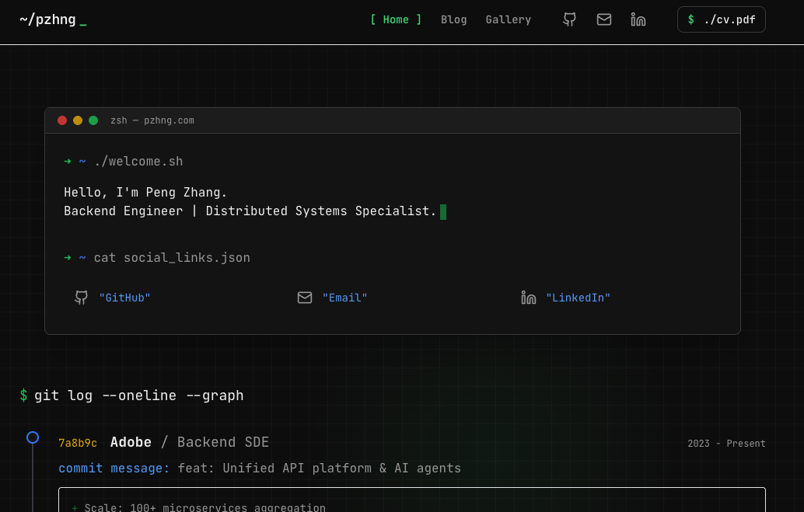

# Peng Zhang - Personal Portal

A concise, tech-savvy personal website and portfolio built with the "SDE/Terminal" aesthetic.
Designed to focus on content and typography, featuring a dark mode terminal theme, interactive CLI elements, and a seamless blog powered by Notion.

🔗 **Live Site**: [pzhng.com](https://pzhng.com)


*(Note: Replace with an actual screenshot if available)*

## ✨ Features

- **Terminal Aesthetic**:
  - Monospace typography (JetBrains Mono).
  - Terminal-like header navigation with blinking cursor animations (`~/pzhng _`).
  - "Status bar" footer with code-style metadata.
- **Interactive Elements**:
  - **Cursor Spotlight**: A dynamic flashlight effect that reveals a subtle background tech grid.
  - **CLI Hovers**: Navigation links feature `> Link` and `[ Active ]` states.
  - **Executable Actions**: "Download CV" styled as a shell command `./cv.pdf`.
- **Blog & CMS**:
  - **Notion as CMS**: Write and manage posts entirely in Notion.
  - **Tech-First Rendering**: Code blocks with syntax highlighting, "file path" breadcrumbs for posts.
  - **Zero-Friction Publishing**: Updates in Notion reflect instantly on the site (ISR/Revalidation).
- **Gallery**:
  - A clean, grid-based photo gallery for capturing life's moments.
- **Performance**:
  - Static generation with Next.js.
  - Deployed on Cloudflare Pages for edge performance.

## 🛠️ Tech Stack

- **Framework**: [Next.js 15](https://nextjs.org/) (App Router)
- **Styling**: [Tailwind CSS](https://tailwindcss.com/)
- **CMS**: [Notion API](https://developers.notion.com/) + `react-notion-x`
- **Deployment**: [Cloudflare Pages](https://pages.cloudflare.com/)
- **Icons**: [Lucide React](https://lucide.dev/)
- **Fonts**: [JetBrains Mono](https://www.jetbrains.com/lp/mono/) & [Inter](https://rsms.me/inter/)

## 🚀 Getting Started

### Prerequisites

- Node.js (v18+)
- A Notion integration token and a database ID for the blog/gallery.

### Installation

1.  **Clone the repository**:
    ```bash
    git clone https://github.com/Kiwitwitter/personal-portal.git
    cd personal-portal
    ```

2.  **Install dependencies**:
    ```bash
    npm install
    ```

3.  **Configure Environment Variables**:
    Create a `.env.local` file in the root directory:
    ```bash
    NOTION_TOKEN=secret_your_notion_token
    NOTION_BLOG_DATABASE_ID=your_blog_database_id
    NOTION_GALLERY_DATABASE_ID=your_gallery_database_id
    ```

4.  **Run Development Server**:
    ```bash
    npm run dev
    ```
    Open [http://localhost:3000](http://localhost:3000) to view it in the browser.

## 📦 Deployment

### Cloudflare Pages

This project is configured for Cloudflare Pages with `next-on-pages`.

1.  Connect your GitHub repository to Cloudflare Pages.
2.  Set the **Build Command** to:
    ```bash
    npx @cloudflare/next-on-pages@1
    ```
3.  Set the **Output Directory** to:
    ```bash
    .vercel/output/static
    ```
4.  Add your `NOTION_TOKEN` and database IDs to the Cloudflare Pages **Environment Variables** settings.

## 🤝 Contribution

This is a personal portfolio, but feel free to fork and adapt the code for your own use!

## 📄 License

This project is open source and available under the [MIT License](LICENSE).

---
*Built with code & soul by Peng Zhang.*
